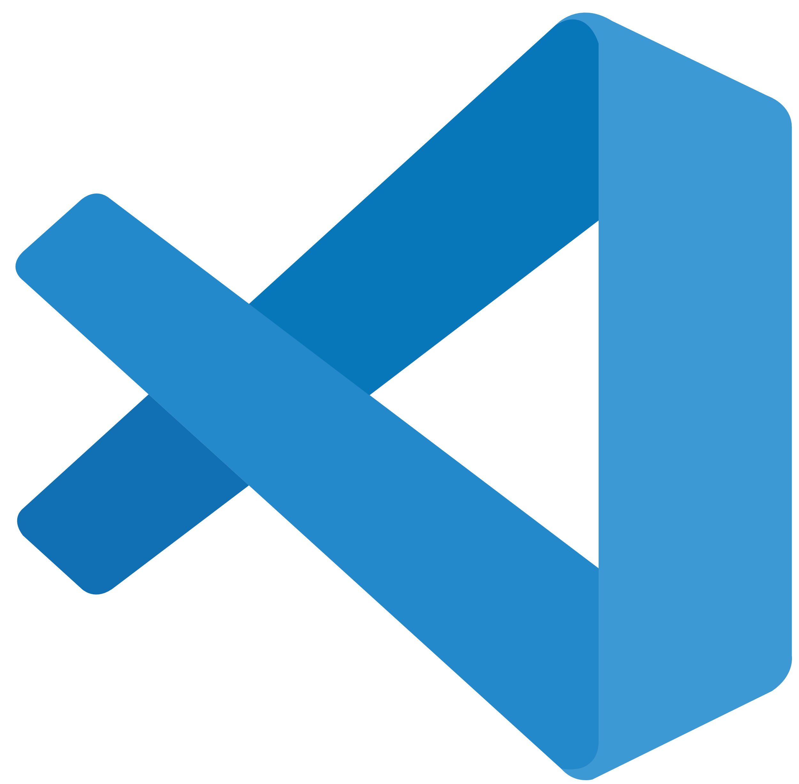
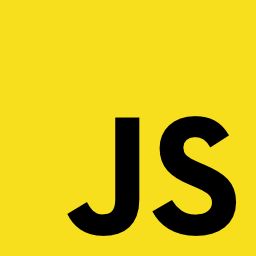
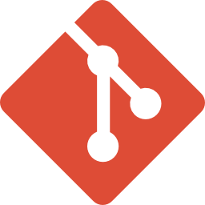

# Hello, I'm Arsh aka developingWeb 

### I'm from India living in Jaipur

- 👀 I’m interested in fullstack development
- 🌱 I’m currently learning react
- 💞️ I’m looking to collaborate on frontend projects
- 📫 You can mail me at arshgoyal2005@gmail.com

 

## Technologies and Tools

  
  
  
  
  
  
  

 

## Github Stats

